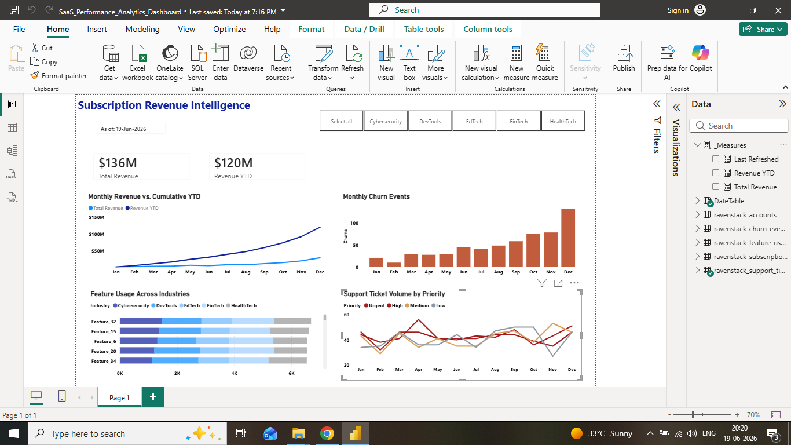

# Strategic SaaS Performance Metrics Dashboard

## 📊 Project Overview & Business Strategy
In the enterprise SaaS ecosystem, leadership teams require immediate, data-driven visibility into recurring revenue, customer retention, and operational efficiency to drive sustainable growth. 

This repository features an enterprise-grade Power BI analytics solution designed to transform raw transactional data into actionable executive insights. The project bridges the gap between financial performance and customer success operations by tracking critical North Star metrics across subscription lifecycles, churn events, and support ticketing workflows.

### 🎯 Key Business Questions Addressed:
* **Revenue Velocity:** How is monthly recurring revenue trending against year-to-date (YTD) cumulative targets?
* **Customer Retention:** What factors and industry segments are heavily driving customer churn?
* **Operational Efficiency:** Are customer support teams effectively managing ticket volume spikes based on severity and priority levels?

---

## 🛠️ Technical Architecture & Data Hygiene
A senior data analyst builds reports with data scalability and governance in mind. This project prioritizes clean data pipelines and optimized data modeling before any front-end visuals are constructed.

### 📐 The Star Schema Data Model
Instead of relying on a single, messy flat file, the data model is built on an optimized **Star Schema** architecture to maximize performance and calculation efficiency:
* **Fact Tables:** Centralized transactional tables storing daily metrics for subscriptions, churn events, and support tickets.
* **Dimension Tables:** Specialized lookup tables for Accounts, Industry features, and a custom-built **DateTable** to ensure seamless time-intelligence reporting.

### 🧹 Power Query (M) Data Engineering & Polish
To enforce absolute professional presentation standards, raw data was engineered upstream in Power Query:
* **Case Standardization:** Standardized mixed-case text fields (e.g., converting lowercase and mismatched labels for features and priorities into clean, capitalized text) to ensure pristine visual categorizations.
* **Custom Ordinal Sorting:** Overrode default alphabetical limitations (which natively sort priority levels as *High ➔ Low ➔ Medium ➔ Urgent*) by engineering a custom `Priority Sort Order` conditional column. This forces an intuitive, high-to-low severity sequence (*Urgent ➔ High ➔ Medium ➔ Low*) across all dashboard legends.

* ---

## 🔢 Advanced DAX Measures & Business Logic
To power the dashboard's KPIs and time-intelligence trends, custom DAX measures were engineered to track revenue momentum and operational performance. Below are key formulas utilized in the model:

### 1. Cumulative Year-to-Date (YTD) Revenue
To evaluate revenue velocity against historical performance, this measure dynamically aggregates total revenue from the start of the fiscal year through each consecutive month:
```dax
Cumulative YTD Revenue = 
TOTALYTD(
    SUM(ravenstack_subscription_metrics[Revenue]),
    'DateTable'[Date]
)

### 2. Month-over-Month (MoM) Churn Rate
To evaluate customer retention health against the total subscriber base, this measure dynamically calculates the proportion of closed accounts to track early-warning trends in customer attrition:
```dax
MoM Churn Rate = 
DIVIDE(
    COUNT(ravenstack_churn_events[account_id]),
    COUNT(ravenstack_accounts[account_id]),
    0
)

### 3. Dynamic Ticket Escalation Rate
To evaluate operational efficiency and product stability, this measure dynamically isolates critical customer support issues requiring senior engineering intervention against total log volume to monitor service delivery health:
```dax
Escalation Rate = 
DIVIDE(
    CALCULATE(COUNT(ravenstack_support_tickets[ticket_id]), ravenstack_support_tickets[escalation_flag] = "Yes"),
    COUNT(ravenstack_support_tickets[ticket_id]),
    0
)

---

## 🎨 UI/UX Design Optimization & Executive Psychology
A dashboard’s impact is defined by its scannability. This project applies advanced data-to-ink ratio principles to eliminate visual clutter and ensure senior executives can extract insights within 3 seconds of viewing a chart.

* **Psychology-Driven Semantic Coloring:** Developed a custom corporate color palette utilizing high-contrast terracotta tones for financial metrics and an intuitive severity scale (Crimson for *Urgent* descending to a muted Grey for *Low*) on support workflows to guide the viewer’s eye naturally to risk areas.
* **Streamlined Data-to-Ink Ratio:** Eliminated default dashed gridlines across the canvas to place visuals on a crisp, distraction-free background. 
* **Optimized Visual Space:** Strategically removed high-density line data labels in favor of a clean, persistent Y-axis metric scale, preventing "number soup" overcrowding and allowing line intersection trends to remain clearly legible.

---

## 💡 Strategic Executive Insights & Action Items
Based on the synchronized performance metrics across the dashboard, three critical business recommendations have been identified for leadership:

1. **Address Q4 Retention Anomalies:** While Year-to-Date (YTD) cumulative revenue shows steady linear growth, customer churn metrics peak significantly toward the end of the fiscal year. Customer Success teams should deploy targeted outreach campaigns 90 days prior to Q4 contract renewal cycles.
2. **Support Resource Re-allocation:** Support ticket volumes for *Urgent* and *High* priority issues exhibit predictable spikes during mid-year product feature release windows. Engineering and support staffing schedules should be adjusted to scale up capacity during these high-risk intervals.
3. **Cross-Industry Stabilization:** Feature usage data indicates heavily disparate adoption across different vertical segments (e.g., Tech vs. Finance). Product management should investigate low-adoption industries to identify gaps in market-product fit.
